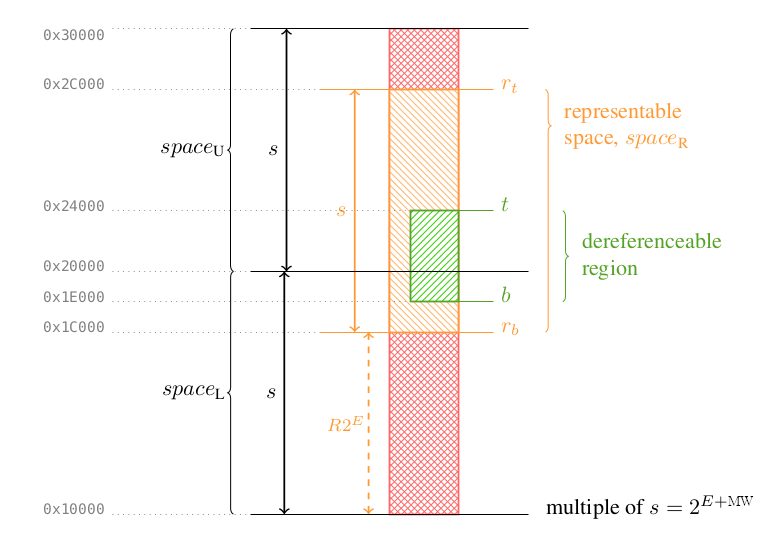

[[rv32y]]
== {cheri_base32_ext_name} and {cheri_base64_ext_name} Base Capability Instruction Sets, Version 1.0

ifdef::cheri_standalone_spec[]
WARNING: This chapter will appear in the unpriv spec after the RV32I chapter.
endif::[]

This chapter describes the {cheri_base32_ext_name} and {cheri_base64_ext_name} base capability instruction sets, that extend the RV32I and RV64I instruction sets with CHERI.
Other standard options to bases are also supported such as E (16-registers), Zfinx and endianess.

=== CHERI encoding formats

CHERI implementations are required to choose a capability encoding format.
The CHERI base ISA name is extended with the capability encoding format in use.

The definition of all CHERI base ISAs include sufficient details of a capability encoding format to give enough details to allow execution of all base ISA instructions.

As a result, the {cheri_base32_ext_name} and {cheri_base64_ext_name} names on their own do not describe complete base ISAs, as a capability encoding must be selected.

The currently available base ISAs including capability encoding formats are listed below:

* For {cheri_base64_ext_name}, the capability encoding format from the University of Cambridge covering the full 64-bit address space:
** {rvy64_uni_base_name}
** {rvy64e_uni_base}
* For {cheri_base32_ext_name}, the capability encoding format from the University of Cambridge covering the full 32-bit address space and optional RISC-V compatibility with {cheri_default_ext_name}:
** {rvy32_uni_base_name}
ifndef::cheri_ratification_v1_only[]
* For {cheri_base32_ext_name}E, the CHERIoT encoding optimized for smaller devices:
** {rvy32e_cheriot_base_name}

NOTE: RV32YE (16-register) implementations are recommended to use the {rvy32e_cheriot_base_name} format.

endif::[]

NOTE: The base + encoding format scheme is designed to simply allow more encoding formats to be added in the future, to allow the formats to be optimized for specific applications.

NOTE: {rvy_uni_base_name} bases are closely based upon features from CHERI v9 cite:[cheri-v9-spec], and the bounds encoding scheme is based upon CHERI Concentrate cite:[woodruff2019cheri].

Custom capability encoding formats may be implemented for vendor-specific non-standard implementations.

=== CHERI Overview

CHERI enhances the base ISA to add hardware memory access control.
It has an additional memory access mechanism that protects _references to code and data_ (pointers), rather than the _location of code and data_ (integer addresses).
This mechanism is implemented by providing a new primitive, called a *capability*, that software components can use to implement strongly protected pointers within an address space.
Capabilities are unforgeable and delegatable tokens of authority that grant software the ability to perform a specific set of operations.
In CHERI, integer-based pointers are replaced by capabilities to provide memory access control.

=== CHERI protection model

The CHERI model is motivated by the _principle of least privilege_, which
argues that greater security can be obtained by minimizing the privileges
accessible to running software. A second guiding principle is the _principle of
intentional use_, which argues that, where many privileges are available to a
piece of software, the privilege to use should be explicitly named rather than
implicitly selected. While CHERI does not prevent the expression of vulnerable
software designs, it provides strong vulnerability mitigation: attackers have a
more limited vocabulary for attacks, and should a vulnerability be successfully
exploited, they gain fewer rights, and have reduced access to further attack
surfaces.

Protection properties for capabilities include the ISA ensuring that
capabilities are always derived via valid manipulations of other capabilities
(_provenance_), that corrupted^1^ in-memory capabilities cannot be dereferenced
(_integrity_), and that rights associated with capabilities shall only ever be
equal or less permissive (_monotonicity_). Tampering or modifying capabilities
in an attempt to elevate their rights will yield an invalid capability.
Attempting to dereference via an invalid capability
will result in a hardware exception.

^1^ Not all possible corrupted states are detected, see xref:section_cap_integrity[xrefstyle=full].

CHERI capabilities may be held in registers or in memories, and are loaded,
stored, and dereferenced using CHERI-aware instructions that expect capability
operands rather than integer addresses. On system initialization, initial capabilities
are made available to software by the execution environment via general purpose
registers. All other capabilities will be derived from these initial valid
capabilities through valid capability transformations.

Developers can use CHERI to build fine-grained spatial and temporal memory
protection into their system software and applications and significantly
improve their security.

[#sec_capability_registers]
=== Capability Registers and Format

{cheri_base_ext_name} extends all registers that have to be able to hold addresses to `2*XLEN` bits (hereafter referred to as YLEN), adding metadata to protect its integrity, limit how it is manipulated, and control its use.
In addition to widening to YLEN, each register also gains one-bit {ctag} which is defined below.

{cheri_base_ext_name} specify the fields which the capability format supports, and how those fields behave for XLEN=32 and XLEN=64.

The exact encoding format of the capability is described in <<app_cap_description>>.

NOTE: Future extensions may redefine the capability format providing they follow the rules defined by the {cheri_base_ext_name} base ISA.

.CHERI Capability structure
[#cap_structure]
[bytefield]
----
(defattrs :plain [:plain {:font-family "M+ 1p Fallback" :font-size 25}])
(def row-height 80)
(def row-header-fn nil)
(def boxes-per-row 32)
(draw-column-headers {:height 50 :font-size 18 :labels (reverse (concat ["0"] (repeat 28 "") ["XLEN-1" "" ""]))})

(draw-box "V"    {:span 1})
(draw-box "" {:span 1 :borders {}})
(draw-box "Metadata (bounds, permissions, etc.)"    {:span 30})
(draw-box "" {:span 2 :borders {}})
(draw-box "Address"     {:span 30})
(draw-box "" {:span 2 :borders {}})
(draw-box "XLEN" {:span 30 :borders {}})
----

==== Address

The lower XLEN bits of a capability encode the address of where the capability points.
This is also referred to as the integer part of the capability.
For registers that are extended but currently hold non-capability data, all other fields are typically zero.

NOTE: Future extensions may add 2*XLEN-bit operations to make use of the wide registers for efficient handling of 2*XLEN-bit non-capability data.

[#cap_valid_tag,reftext="{ctag}"]
==== {ctag_title}

The {ctag} is an additional bit added to addressable memory and all YLEN-bit registers.
It is stored separately and may be referred to as _out of band_ or _hidden_, and is _hardware managed_.
It indicates whether a YLEN-bit register or YLEN-aligned memory location contains a valid capability.
If the {ctag} is set, the capability is valid and can be dereferenced (contingent on checks such as permissions or <<sec_cap_bounds_overview,bounds>>).

All registers or memory locations able to hold a capability are YLEN bits wide with an additional hidden {ctag} bit.
These are referred to as being _YLEN-bit_ in this specification.

The {ctag} cannot be directly set to one by software, it is _not_ a conventionally accessible bit of state.
If the {ctag} is set then it shows that the capability has been derived correctly according to the principles listed above (_provenance_, _integrity_, _monotonicity_).
If the rules are followed then the {ctag} will propagate through the instructions that modify, load or store the capability.

Therefore, for capability manipulation in registers:

* Any instruction that wrote the capability to a register had at least one {ctag} set in its input operands.
** This is the _provenance_ check.
* Any instruction that wrote the capability to a register requested a legal operation that does not increase bounds or permissions, and set the {ctag} on the output.
** This is the _monotonicity_ check.
* Any instruction that wrote the capability to a register detected corrupted values.
** This is the _integrity_ check.

Capability load/store require the _provenance_ check:

* Any store that wrote the capability to memory was correctly authorized
* Any load that read the capability from memory was correctly authorized

When an operation fails a check, either due to software error or malicious intent, then the operation raises an exception or sets the resulting {ctag} to zero.

Using an invalid capability to dereference memory or authorize any operation raises an exception.
All capabilities derived from invalid capabilities are themselves invalid, i.e., their {ctag}s are zero.

NOTE: When the {ctag} is zero, the register or memory location may be used to store non-capability data.

==== {ctag_cap}s in registers

Every YLEN-bit register has a one-bit {ctag}, indicating whether the capability in the register is valid to be dereferenced.
This {ctag} is cleared whenever an invalid capability operation is performed.
Examples of such invalid operations include writing only the integer portion (the address field) of the register or attempting to increase bounds or permissions.

==== {ctag_cap}s in memory

{ctag_cap}s are tracked through the memory subsystem: every aligned YLEN-bit wide region has a non-addressable one-bit {ctag}, which the hardware manages atomically with the data.
The {ctag} is set to zero if any byte in the YLEN/8 aligned memory region is ever written using an operation other than a store of a capability operand which is permitted to set the {ctag} to one (see <<c_perm>>), and that the stored capability data has its {ctag} set.

NOTE: All system memory and caches that store capabilities must preserve this abstraction, handling the {ctag}s atomically with the data.

[#sec_cap_bounds_overview]
==== Capability Bounds

Capabilities encode memory bounds, i.e., the lowest and highest byte in memory that it is permitted to access when dereferenced for data memory access, or for instruction execution.

Checking is on a byte-by-byte basis, so that it is possible for a memory access to be fully in-bounds, partially out-of-bounds or fully out-of-bounds.

It is not permitted to make any partially or fully out-of-bounds memory accesses.

Every capability has two memory address bounds: _base_ representing the lowest accessible byte, and _top_ representing one byte above the highest accessible byte.

* The _base_ is XLEN bits and is _inclusive_.
* The _top_ is (XLEN+1)-bits and is _exclusive_.
** The extra bit is required to allow the bounds to include the top byte of memory.
* The _length_ is (XLEN+1)-bits and is defined to be _top - base_.

Therefore a memory location `A` in the range `base &#8804; A < top` is within bounds, and so valid to access.

NOTE: Inclusive _top_, with XLEN bits, was considered but rejected in favor of the exclusive _top_.

NOTE: Checking every byte of every executed instruction and every byte of every data memory access is fundamental to the memory safety which CHERI provides.
In a typical load/store unit, the expansion of the bounds from `{cs1}` and bounds checking is in parallel with the address calculation, the memory translation and/or the PMA/PMP checking.

A compressed format is used to encode the bounds with a scheme similar to floating-point using an exponent and a mantissa.
Therefore small exponents can allow byte granularity on the bounds, but larger exponents give coarser granularity.

The {cheri_base_ext_name} bounds encoding format is defined in <<section_cap_bounds>>.

NOTE: Future extensions may use alternative bounds encoding formats.
Software can query the capability format by reading the <<uycfg>> CSR.

Software can query the capability bounds:

* The _base_ is returned by the <<GCBASE>> instruction.
* The _length_ is returned by the <<GCLEN>> instruction.
** <<GCLEN>> saturates the _length_ to XLEN bits
* The _top_ can be calculated using a saturating addition of the <<GCBASE>> and <<GCLEN>> results.

NOTE: A future extension may add an instruction to directly read the _top_ if needed for performance.

==== Deriving New Bounds

On system initialization, one or more <<root-cap>> capabilities are available;
typically, these have bounds which cover all of memory and the maximum permissions set.
All smaller capabilities are derived from these.

The ISA does not allow the bounds (and permissions) of a capability with its {ctag} set to be increased (_monotonicity_).

Bounds can be programmed using the <<SCBNDS>>, <<SCBNDSI>> and <<SCBNDSR>> instructions, which set the current address to be the _base_ bound and the _length_ to be the operand (`rs2` or `imm`) value.
The granularity constraints means that not all requested combinations of _top_ and _base_ bounds can be encoded exactly.

* <<SCBNDS>> sets the _base_ to `{cs1}.address`, and the _length_ to `rs2`. Set the {ctag} to zero if the bounds cannot be encoded exactly.
* <<SCBNDSI>> sets the _base_ to `{cs1}.address`, and the _length_ to the immediate value. Set the {ctag} to zero if the bounds cannot be encoded exactly.
* <<SCBNDSR>> sets the _base_ to `{cs1}.address`, and the _length_ to `rs2`. The bounds may be rounded up if they cannot be encoded exactly.
** If <<SCBNDSR>> rounds up the requested bounds, they must still be no larger than the initial bounds.
* <<CRAM>> can be used to calculate the nearest precisely encodable _length_ and _base_ values for a given size.

// #some example usage here of CRAM+SCBNDSR would be good#

The bounds are encoded relative to the address field, sharing some upper bits of the address.
The number of shared bits depends on the exponent, see xref:section_cap_bounds[xrefstyle=short].

[#section_rep_check_concept]
==== Representability and Updating the Address

Because the CHERI Concentrate cite:[woodruff2019cheri] encoding scheme for memory bounds shares the upper bits of the address with the bounds, not all out-of-bounds pointers can be represented.

NOTE: The historic, uncompressed CHERI-MIPS 256-bit capability encoding had separate 64-bit values for the base and top memory bounds, and another for metadata fields.
 This scheme could represent all out-of-bounds pointers with a very high hardware cost.

The maximum range of address values that the pointer can take without changing the interpretation of bounds is defined by the <<section_cap_representable_check,representable region>>.
Since deriving a new capability with a different address could change the meaning of the bounds, all such derived capabilities (e.g., deriving the next <<pcc>> capability from the existing <<pcc>> via control-flow instructions or sequential execution) and instructions that return valid derived capabilities, must check that the new address is within the representable region defined by the source capability.
If the interpretation of bounds _has_ changed, then the {ctag} of the derived capability is set to zero, so that it is invalid for use.

Software can derive a capability with a new address using instructions such as <<SCADDR>>, <<CADD>> and <<CADDI>>.

NOTE: <<SCADDR>> writes back a derived capability with a new address field and, if the {ctag} was previously set, sets the {ctag} of the derived capability to one if the resulting capability still has the same bounds interpretation.

NOTE: Existing software sometimes temporarily moves pointers outside of arrays, and then only come back into the valid range on dereference, so the encoding was designed to allow valid capabilities to be out-of-bounds.

NOTE: {cheri_base_ext_name} implementations that use a different encoding scheme to <<app_cap_description>> (e.g., for accelerators or specific micro-controllers, see <<uycfg>>) may specify an alternative to the representable region check, and may never allow the address to be out of bounds.
Therefore, the rest of the specification uses the phrase *represented exactly* for this check.

The bounds and representable region (or space) for <<app_cap_description>> are illustrated in <<cap_bounds_map>>.
E, MW and R in the figure are all introduced in xref:section_cap_bounds_decoding[xrefstyle=short] along with the bounds decoding.

[#cap_bounds_map]
.Memory address bounds encoded within a capability

==== Memory space

A hart supporting {cheri_base_ext_name} has a single byte-addressable address
space of 2^XLEN^ bytes for all memory accesses. Each memory region capable of
holding a capability also stores a {ctag} bit for each naturally aligned YLEN bits
(e.g., 16 bytes in RV64), so that capabilities with their {ctag} set can only be
stored in naturally aligned addresses. {ctag_cap}s must be atomically bound to the
data they protect.

The memory address space is circular, so the byte at address
2^XLEN^ - 1 is adjacent to the byte at address zero. A capability's
<<section_cap_representable_check>> described in xref:section_cap_encoding[xrefstyle=short] is
also circular, so address 0 is within the <<section_cap_representable_check>> of a capability
where address 2^MXLEN^ - 1 is within the bounds.
However, the decoded top address of a capability is MXLEN + 1 bits wide and does *not* wrap, so
a capability with base 2^MXLEN^ - 1 and top 2^MXLEN^ + 1 is not a subset of the
infinite capability and does not authorize access to the byte at address 0.
Like malformed bounds (see xref:section_cap_malformed[xrefstyle=short]), it is impossible for
a CHERI core to generate a valid capability with top > 2^MXLEN^.
If such a capability exists then it must have been caused by a logic or memory fault.
Unlike malformed bounds, the top overflowing is not treated as a special case in the
architecture: normal bounds check rules should be followed.

[#sec_cap_type, reftext="CT-field"]
==== Capability Type (CT)

#Begin changed since last ARC review#

This metadata value indicates the type of the capability.
The sole type defined in the {cheri_base_ext_name} base ISA is `0`.
The type determines which operations the capability authorizes;
extensions to {cheri_base_ext_name} will define additional types and
give additional semantics for capabilities with such types.

Which capability types a given CHERI platform supports is a function
of the extensions and capability encoding format in use.
The capability encoding additionally specifies a mapping between
some bits within the capability format (usually described as "the CT field")
and the space of capability types.
The mapping must be able to encode type `0` but has few other requirements.
It need not, for example, be interpreted as an (un)signed binary rendering of CT values.

#End changed since last ARC review#

[#unsealed_cap,reftext="unsealed capability]
Unsealed capabilities::
When `CT=0`, the capability authorizes access to a region of memory as defined by the permissions and bounds.

[#sealed_cap,reftext="sealed capability"]
Sealed capabilities::
Capabilities with `CT≠0` are sealed against modification and cannot be dereferenced to access memory.
Instructions that operate on capabilities will produce a result with a cleared {ctag} if the source capability is sealed and the operation would alter its address, bounds, or permissions.
Extensions that augment capability metadata must describe their interaction(s) with sealed capabilities.

#Begin new since last ARC review#

Given a capability with `CT=0`,
deriving a capability with `CT≠0` is termed "sealing"
(or "sealing with type ``x``" when a particular output ``CT=x`` is meant).
In the other direction,
deriving a `CT=0` capability from a `CT≠0` capability is termed "unsealing"
(or "unsealing from type ``x``" when a particular input ``CT=x`` is meant).
In general, each of these actions may require *authority*
to operate at the non-zero type;
extensions will specify how software expresses this authority
for types not defined above.

Capability encodings may also make the set of <<sec_cap_type>> values
that may be used to seal a particular capability
depend on the the permissions granted by that capability.
For example, it can be a useful space optimization to differentiate
the <<sec_cap_type>> values for capabilities granting <<x_perm>>
from those not granting <<x_perm>>;
the <<x_perm>> in the capability encoding effectively adds
an additional bit to the <<sec_cap_type>> field.
(<<app_cap_description>> does not avail itself of this option,
but, for example, the CHERIoT capability encoding does.)

[#sec_cap_type_ambient]
Ambient sealing type::
Some capability types are said to be "ambiently available" (or just "ambient")
if they do not require specific authority to seal a capability (with that type).
For example, if <<section_rvy_sentry_insn_ext>> is available on a given platform,
the type with which it seals capabilities is considered ambiently available.
(With the capabilities of <<app_cap_description>>, that would be type `1`.)

[#sentry_cap,reftext="sentry capability"]
Sentry capability type::
It is useful to have *immutable* function pointers within a CHERI software system.
<<sealed_cap,Sealed capabilities>> are a natural foundation, providing immutability.
<<JALR_CHERI>> may unseal capabilities of particular, encoding-specified types before installing them to the program counter.
Capabilities sealed with such a type are are dubbed "sentries" (a portmanteau of "sealed entries").
<<JALR_CHERI>> may also _seal_ the return pointers it generates with encoding-specified types.

NOTE: Sentry capabilities can establish a form of control-flow integrity between mutually distrusting code.

#End new since last ARC review#

NOTE: In addition to using sealed capabilities as sentries for secure entry points, sealed capabilities can also be useful to software as secure software tokens.
 <<YSUNSEAL>> can be used to convert such a token back to an unsealed capability.
 A future extension may add an unseal instruction for performance.

[#AP-field, reftext="AP-field"]
==== Architectural Permissions (AP)

This metadata field encodes architecturally defined permissions of the capability.
Permissions grant access subject to the <<cap_valid_tag>> being set, the capability being unsealed, and bounds checks passing.
Any operation is also contingent on requirements imposed by other RISC-V architectural features, such as virtual memory, PMP and PMAs, even if the capability grants sufficient permissions.
The permissions currently defined in {cheri_base_ext_name} are listed below.

Permissions can be cleared when deriving a new capability value (using <<CLRPERM>>) but they can never be added.

NOTE: The encoding of permissions varies with MXLEN and is described in xref:AP-field-encoding[xrefstyle=full].

.AP-field summary
[#ap_field_summary,width="100%",options=header,halign=center,cols="2,2,5"]
|==============================================================================
| Permission   | Type | Comment
| <<r_perm>>   | Data memory permission         | Authorize data memory read access
| <<w_perm>>   | Data memory permission         | Authorize data memory write access
| <<x_perm>>   | Instruction memory permission  | Authorize instruction memory execute access
| <<c_perm>>   | Data memory permission         | Authorize loading/storing of {ctag}s
| <<lm_perm>>  | Data memory permission         | Used to restrict the permissions of loaded capabilities.
| <<asr_perm>> | Privileged state permission    | Authorize privileged instructions and CSR accesses.
|==============================================================================

[#r_perm,reftext="R-permission"]
Read Permission \(R):: Allow reading data from memory.

[#w_perm,reftext="W-permission"]
Write Permission (W):: Allow writing data to memory.

[#x_perm,reftext="X-permission"]
Execute Permission (X):: Allow instruction execution.

[#c_perm,reftext="C-permission"]
Capability Permission \(C)::
Allow reading {ctag}s from memory if <<r_perm>> is also granted.
+
Allow writing {ctag}s to memory if <<w_perm>> is also granted..
+
If <<c_perm>> is missing then the {ctag}s for capability loads and stores are read and written as zero.

[#lm_perm,reftext="LM-permission"]
Load Mutable Permission (LM):: Allow preserving the <<w_perm>> of capabilities loaded from memory.
If a capability grants <<r_perm>> and <<c_perm>>, but no <<lm_perm>>, then a capability loaded via this authorizing capability will have <<w_perm>> and <<lm_perm>> removed.
+
The permission stripping behavior _only_ applies to loaded capabilities that have their {ctag} set and are not sealed.
This ensures that capability loads of non-capability data do not modify the loaded value, and that sealed capabilities are not modified.

NOTE: Clearing a capability's <<lm_perm>> and <<w_perm>> allows sharing a read-only version of a data structure (e.g., a tree or linked list) without making a copy.

ifdef::cheri_v9_annotations[]
NOTE: *CHERI v9 Note:* This permission does not exist in CHERI v9, but is similar to CHERIoT's _LoadGlobal_ permission, except that any _global_ capability implicitly grants _LoadGlobal_.
endif::[]

[#asr_perm,reftext="ASR-permission"]
Access System Registers Permission (ASR, primarily used to authorize CSR accesses):: Allow read and write access to all privileged CSRs, some unprivileged CSRs and some privileged instructions.
In {cheri_base_ext_name}, the only affected CSR is the unprivileged <<utidc>> CSR, which requires <<asr_perm>> for writing, but not for reading.
ASR permission is used for additional permission checks by some instructions from other extensions such as <<Zicbom>>.

<<asr_perm>> permission checks always use the permission in the <<pcc>>.

NOTE: This permission is important in privileged execution environments.
  Removing this permission allows constraining privileged software to a sandbox that cannot be subverted by changing privileged state.

NOTE: Extensions may add additional non-privileged CSRs that require <<asr_perm>>.

[#sec_permission_transitions]
===== Permission Transitions

Not all capability permissions are _orthogonal_
(that is, some permissions inherently _depend_ on others).
As such, using <<CLRPERM>> to clear some permissions
may have the effect of clearing others as well,
such that a permission bit being set in the result of <<GCPERM>>
implies that all bits for permissions upon which it depends will also be set.

For the base set of permissions just defined, the following rules apply.
Extensions that define new permission bits may also introduce new dependency constraints.
Currently defined examples are:

. <<section_cheri_hybrid_ext,{cheri_default_ext_name}>>, see <<sec_m_bit_hybrid_rule>>
. <<section_zylevels1>>, see <<zylevels1-clrperm-rules>>
ifdef::cheri_standalone_spec[]
. <<section_zyseal>>, see <<zyseal_ap_field>>
endif::[]

Capability _encodings_ may impose additional constraints.
to reduce the number of bits necessary to represent permissions.

.<<CLRPERM>> base rules
[float="center",align="center",cols="2,2,4",options="header"]
|===
| <<CLRPERM>> Rule                          | Permission   | Valid only if
| [[perm_req:base:c:r-or-w,base-1]]base-1   | <<c_perm>>   | <<r_perm>> or <<w_perm>>
| [[perm_req:base:lm:c-and-r,base-2]]base-2 | <<lm_perm>>  | <<c_perm>> and <<r_perm>>
| [[perm_req:base:asr:x,base-3]]base-3      | <<asr_perm>> | <<x_perm>>
|===

When using <<app_cap_description,{rvy_uni_base_name}>> and {cheri_base32_ext_name} the complete set of rules with and without <<section_cheri_hybrid_ext,{cheri_default_ext_name}>> and <<section_zylevels1>> are shown in <<clrperm-rules-no-zylevels1>> and <<clrperm-rules-zylevels1>>.

[#sec_cap_sdp]
==== Software-Defined Permissions (SDP)
The metadata also contains an encoding-dependent number of software-defined permission (SDP) bits.
They can be inspected by the kernel or application programs to enforce restrictions on API calls (e.g., permit/deny system calls, memory allocation, etc.).
They can be cleared by <<CLRPERM>> but are not interpreted by the CPU otherwise.

While these bits are not used by the hardware as architectural permissions, modification follows the same rules: SDP bits can only be cleared and never set on valid capabilities.

NOTE: This property is required to ensure restricted programs cannot forge capabilities that would pass the software-enforced checks.

[#section_special_caps]
==== Special Capabilities

[#root-cap,reftext="Root"]
===== Root Capabilities

_Root_ (sometimes also _primordial_, _initial_) capabilities are those provided by the system at reset.
In some systems (and capability encodings), there is a single "Infinite" capability value,
which grants all permissions and has bounds covering the whole 2^MXLEN^ address space;
in such systems, root capabilities are often Infinite.
More generally, the _set_ of root capabilities often collectively grant all permissions to all addresses.
By way of example, an encoding may prohibit one capability from authorizing both write and execute;
a system using such an encoding would typically make available maximally permissive
read-write and read-execute capabilities as part of their root set.

[NOTE]
=====
How unprivileged software receives its root capabilities is largely an ABI question;
the privileged specification will detail requirements of capability registers' reset state
(and so on the root capabilities held therein).
=====

Because particular sets of requirements recur throughout the specification,
we define some useful short-hand terminology.

[#root-rx-cap,reftext="Root Executable"]
Root Executable Capability::
An unsealed capability that has bounds covering all addresses
and grants at least all of <<x_perm>>, <<r_perm>>, <<c_perm>>, <<lm_perm>>, and <<asr_perm>>.
Extensions introducing new permissions may require these to be provided by root executable capabilities.

[#root-rw-cap,reftext="Root Data"]
Root Data Capability::
An unsealed capability that has bounds covering all addresses
and grants at least all of <<r_perm>>, <<w_perm>>, <<c_perm>>, and <<lm_perm>>.
Extensions introducing new permissions may require these to be provided by root data capabilities.

[#null-cap,reftext="NULL"]
===== NULL Capability
A capability with all-zero metadata, a zero {ctag}, and an address of zero is referred to as the _NULL_ capability.
This capability grants no permissions and any dereference results in raising an exception.

=== Extended State

As stated above, all state which can hold addresses are extended from XLEN to YLEN bits.

==== General Purpose Registers

The <<gprs,XLEN-wide integer registers>> (e.g., `sp`, `a0`) are all extended to YLEN bits
and associated {ctag}s, as shown in <<base_cap_registers>>.

.Extended registers in {cheri_base_ext_name}
[#base_cap_registers]
[bytefield,subs=attributes+]
----
(defattrs :plain [:plain {:font-family "M+ 1p Fallback" :font-size 40}])
(def row-height 100)
(def row-header-fn nil)
(def boxes-per-row 65)
(draw-column-headers {:height 30 :font-size 25 :labels (concat ["" "2*XLEN (YLEN)"] (repeat 31 "") ["XLEN"] (repeat 30 "") ["0"])})

(draw-box "" [:box-first {:span 1}]) (draw-box "{creg}0" [:box-related {:span 32}]) (draw-box "x0" [:box-last {:span 32 }])
(draw-box "" [:box-first {:span 1}]) (draw-box "{creg}1" [:box-related {:span 32}]) (draw-box "x1" [:box-last {:span 32 }])
(draw-gap "Same layout for {creg}2-{creg}30" {:height 100})
(draw-box "" [:box-first {:span 1}]) (draw-box "{creg}31" [:box-related {:span 32}]) (draw-box "x31" [:box-last {:span 32 }])
(draw-box nil [:box-first {:span 1}]) (draw-box "{pcc}" [:box-related {:span 32}]) (draw-box "{pcc}" [:box-last {:span 32 }])
(draw-box "V" {:span 1 :borders {}}) (draw-box "Metadata" {:span 32 :borders {}}) (draw-box "Address" {:span 32 :borders {}})
----

// When referring to the extended registers, the `x` prefix is replaced with a `y`: i.e., the extended version of `x1` becomes `{creg}1`.
// The register can be referred to either way - as `{creg}1` accessing all YLEN bits or as `{creg}1` accessing only the address field (i.e., the lower XLEN bits).
// For the ABI register names the `y` prefix is added, e.g., `{abi_creg}sp` to refer to all YLEN bits, and so the assembler can refer to either `sp` or `{abi_creg}sp` depending on the instruction operand.

The zero register is extended with zero metadata and a zero {ctag}: this is called the <<null-cap>> capability.

[#pcc,reftext="{pcc}"]
==== The Program Counter Capability (`{pcc}`)

The `pc` is extended to be a capability.
Extending the `pc` allows the range of branches, jumps and linear execution for currently executing code to be restricted.
The <<pcc>> address field is the `pc` in the base RISC-V ISA so that the
hardware automatically updates it as instructions are executed.

The hardware performs the following checks on <<pcc>> for each instruction
executed in addition to the checks already required by the base RISC-V ISA.
A failing check raises a CHERI exception.

* The {ctag} must be set
* The capability must not be sealed
* The capability must grant execute permission
* All bytes of the instruction must be in bounds
* All <<section_cap_integrity,integrity>> checks passed.

On system initialization the `pc` bounds and permissions must be set such that the program can run successfully (e.g., by setting it to a <<root-rx-cap>> capability to ensure _all_ instructions are in bounds).

NOTE: Future ISA extensions should respect these rules so that the checked bits do not need storing in all copies of the <<pcc>> in the implementation.

.Program Counter Capability
[#pcc-format]
include::img/pccreg.edn[]

==== Added CSRs

{cheri_base32_ext_name} and {cheri_base64_ext_name} add the YLEN-bit CSR shown in
xref:csrnames-added-y[xrefstyle=short] and the XLEN-bit CSR shown in
xref:csrnames-added-x[xrefstyle=short].

[[csrnames-added-y]]
.Unprivileged capability CSRs added in {cheri_base_ext_name}
[%autowidth,float="center",align="center",cols="<,<,<",options="header"]
|===
|YLEN CSR|Permissions|Description
|<<utidc>>|RW, <<asr_perm>> required for writes, not reads|User Thread ID Capability
|===

[[csrnames-added-x]]
.Unprivileged integer CSRs added in {cheri_base_ext_name}
[%autowidth,float="center",align="center",cols="<,<,<",options="header"]
|===
|XLEN CSR|Permissions|Description
|<<uycfg>>|RO; see section for details|Capability encoding version
|===

[#utidc,reftext="utidc"]
===== User Thread Identifier Capability (utidc)

The <<utidc>> register is used to identify the current software thread in user mode.
Any operation that modifies <<utidc>> raises an exception unless the <<asr_perm>> is set in the current <<pcc>>.

NOTE: While the RISC-V ABI includes a _thread pointer (tp)_ register, it is not usable for the purpose of reliably identifying the current software thread because the tp register is a general purpose register and can be changed arbitrarily by untrusted code.
Therefore, this specification offers an additional CSR that facilitates a trusted source for identifying software threads.

.User thread identifier capability register
include::img/utidcreg.edn[]

[NOTE]
=====
#The following should probably move to a programmers guide#

Compartmentalization seeks to separate the privileges between different
protection units, e.g., two or more libraries. Code can be separated by sentries,
which allow for giving out code capabilities to untrusted code where the untrusted
code can only call the code capability, but not modify it. The <<utidc>> register supports
a model where untrusted code is separated by trusted code and each call from one piece of untrusted
code to another piece of untrusted code goes through trusted code. Often, the trusted
code is referred to as a *trampoline*. Sentries can
be called from different software threads and thus there needs to be a way of
identifying the current software thread. While identifying the current software thread
can be done by privileged code, e.g., the kernel, the implied performance
overhead of this is not bearable for CHERI systems with many compartments.

The <<utidc>> register is designed to hold a capability, which can only be used for memory accesses by
trusted code. In a commonly used model on CHERI systems, the trusted code's responsibility
is only to switch between compartments, but not to switch threads. This responsibility is usually
taken over by more privileged code, e.g., an operating system kernel running on a different privilege level.
The privileged code switches software threads and writes the <<utidc>> register.

Every piece of code in the user space (and more privileged levels) can read the contents of the <<utidc>>
register. However, the memory authorized by the capability in <<utidc>> must not be accessible to untrusted code,
but only to trusted code. In order to protect this capability, it can be sealed. The
trusted code will be given means to unseal this capability (say, via <<YSUNSEAL>>).
For the untrusted code, the memory pointed to by <<utidc>> is inaccessible. The sealed capability itself is no secret, but the
memory to which it points is a secret and must not be accessed by any untrusted code.

Trusted code can use <<utidc>> to implement secure compartment switches. Often, the capability therein is
used to implement a trusted stack. Whenever a compartment switch happens, the trusted code can pass arguments between
the caller and callee compartment avoid capability leaks between the two compartments.
The trusted code can store capabilities on the trusted stack when calling out of a compartment and can install them
when returning to the same compartment.
=====

[#uycfg,reftext="uycfg"]
===== CHERI Capability Encoding (uycfg)

The <<uycfg>> register is a read-only XLEN CSR used to identify which CHERI capability encoding is used by the platform.
The capability encoding both determines the in-memory representation of a CHERI capability
and entails a set of extensions present atop {cheri_base_ext_name}.

NOTE:  Alternative capability encoding specifications,
with, for example, new features and/or different bounds granularity,
are possible and would not change how CHERI integrates with the RISC-V ISA,
provided that said encodings still provide the primitives
detailed in <<sec_capability_registers>>.

NOTE: This CSR is read-only, but future extensions may provide a mechanism to modify the capability encoding currently in use.

.CHERI capability encoding CSR (`uycfg`) format
[#ycfg_csr_structure]
include::img/ycfgreg.edn[]

The following values for `uycfg` are defined:

[%autowidth,options=header,cols="^,^,<"]
|===
|Base         |Features|Encoding
| 0x0         | -      | Reserved (unspecified capability encoding)
.2+|0x1       | 0x0    | <<app_cap_description>> capabilities, without <<section_zylevels1>> features
              | 0x1   <| <<app_cap_description>> capabilities, with <<section_zylevels1>> features
|0x2          | 0x0    | Reserved for CHERIoT's (RV32-only) encoding
|===

Future extensions that change capability encoding must define new values.
Extensions that define encodings derived from <<app_cap_description>>
and are generally compatible with this encoding (e.g. they only assign meaning to previously reserved bits) must preserve the Base Encoding field (the bottom 8 bits) as `0x01`.

[NOTE]
=====
We suggest that only low-level, system software query this value directly.
Operating systems and/or runtime environments should provide a mechanism for software
to determine if the platform's capability encoding is backwards-compatible with a given, presumed encoding.
Among other things, such a facility should be used as part of the platform executable loader
to reject executables that expect unknown or known-incompatible CHERI features or capability encodings.
=====

==== Extended CSRs

All CSRs that can hold addresses are extended to YLEN bits.

{cheri_base_ext_name} has three classes of CSR

* XLEN-bit CSRs, which do not contain addresses
** e.g., _fcsr_ from the "F" extension
* XLEN-bit CSRs extended to YLEN bits, which are able to contain addresses (referred to as _extended CSRs_)
** e.g., _jvt_ from the "Zcmt" extension
* YLEN-bit CSRs, which are added by {cheri_base_ext_name} and contain addresses
** e.g., <<utidc>>

When accessing CSRs these rules are followed:

. Accesses to XLEN-bit CSRs are as specified by Zicsr
. Accesses to YLEN-bit CSRs and extended CSRs, using CSRRW will:
.. Read YLEN bits
.. Write YLEN bits, and will write the {ctag} to zero if:
... any <<section_cap_integrity,integrity>> check fails
. Accesses to YLEN-bit CSRs and extended CSRs, using instructions other than CSRRW will:
.. Read YLEN bits
.. Write an XLEN-bit value to the address field, and use the semantics of the <<SCADDR>> instruction to determine the final written value

NOTE: Any YLEN-bit or extended CSR may have additional rules defined to determine the final written value of the metadata and/or to write zero to the {ctag}.

The assembler pseudoinstruction to read a capability CSR `csrr {cd}, csr`, is encoded as `csrrs {cd}, csr, {creg}0`.

.YLEN-bit CSR and Extended CSR access summary for {cheri_base_ext_name}
[#clen_access_summary_base,%autowidth,options=header,align="center"]
|=======================
|Instruction          | Read Width  | Write Width
|CSRRW       rd==x0   |             | YLEN
|CSRRW       rd!=x0   |YLEN         | YLEN
|CSRR[C\|S]  rs1==x0  |YLEN         |
|CSRR[C\|S]  rs1!=x0  |YLEN         | XLEN
|CSRRWI      rd==x0   |             | XLEN
|CSRRWI      rd!=x0   |YLEN         | XLEN
|CSRR[C\|S]I uimm==x0 |YLEN         |
|CSRR[C\|S]I uimm!=x0 |YLEN         | XLEN
|=======================

In <<clen_access_summary_base>>, when there is no read or write width shown, the CSR access is _not_ made and there are no side-effects following standard Zicsr rules.

[#sec_cap_checks]
=== Capability checks

With {cheri_base_ext_name}, every memory access performed by a CHERI core must be authorized by a capability.

Instruction fetches and data memory accesses may result in a fatal exception if the access is out of <<sec_cap_bounds_overview,bounds>>, or if the authorizing capability is missing the required <<AP-field,permissions>>. I.e.,:

* all load instructions requires <<r_perm>>
* all store instructions require <<w_perm>>
* all indirect jumps require <<x_perm>> on the target capability

Instruction fetch is also authorized by a capability: the program counter capability (<<pcc>>) which extends the PC.
This allows code fetch to be bounded, preventing a wide range of attacks that subvert control flow with non-capability data.

The authorizing capability is either named explicitly (the base register of a load/store operation) or implicitly (when executing a branch, <<pcc>> is used for authorization).

E.g., `lw t0, 16({abi_creg}sp)` loads a word from memory, getting the address, bounds, and permissions from the `{abi_creg}sp` (capability stack pointer) register.

No other exception paths are added by {cheri_base_ext_name}: in particular, capability manipulations do not raise an exception, but may set {ctag} of the resulting capability to zero if the operation is not permitted.

=== Added Instructions
{cheri_base_ext_name} adds new instructions to operate on capabilities.
// It might be good to distinguish the operands using some kind of different notion, but for now we were asked to use the same as before.
// To clarify whether an instruction accesses XLEN or YLEN bits of the register, the instruction listing uses `{cd}/{cs1}/{cs2}` for capability operands and `rd/rs1/rs2` for integer operands.

:leveloffset: +1

=== Instructions to Update The Capability Pointer

Creating a new capability with a different address (i.e., updating the pointer) requires specific instructions instead of integer ADD/ADDI.
These instructions all include a check that the resulting address can be <<section_cap_representable_check,represented exactly>> within the new capability.

.Instructions which update the address field summary in {cheri_base_ext_name}
[#tab_cap_ptr_summary,%autowidth,options=header,align="center",cols="1,4"]
|=======================
|Mnemonic     |Description
|<<CADDI>>    |Increment capability address by immediate, <<section_cap_representable_check,represented exactly>> check
|<<CADD>>     |Increment capability address by register, <<section_cap_representable_check,represented exactly>> check
|<<SCADDR>>   |Replace capability address, <<section_cap_representable_check,represented exactly>> check
|=======================

include::insns/cadd_32bit.adoc[]
include::insns/scaddr_32bit.adoc[]

<<<

=== Instructions to Manipulate Capabilities

For security, capabilities can only be modified in restricted ways.
Special instructions are provided to copy capabilities or derive a new capability using manipulations such as _shrinking_ the bounds (<<SCBNDS>>), _reducing_ the permissions (<<CLRPERM>>) or _authorizing_ a capability with another one which has a superset (or identical) bounds and permissions (<<CBLD>>).

.Summary of {cheri_base_ext_name} instructions that create a modified capability
[#tab_cap_manip_summary,%autowidth,options=header,align="center",cols="1,4"]
|=======================
|Mnemonic     |Description
|<<CLRPERM>>   |AND capability permissions (expand to 1-bit per permission before ANDing)
|<<CMV>>      |Move capability register
|<<SCHI>>^1^  |Set metadata and clear {ctag}
|<<SCBNDSI>>  |Set immediate bounds on capability with rounding, clear {ctag} if rounding is required
|<<SCBNDS>>   |Set register bounds on capability with rounding, clear {ctag} if rounding is required
|<<SCBNDSR>>  |Set bounds on capability with rounding up as required
|<<CBLD>>     |Set {cd} to {cs2} with its {ctag} set after checking that {cs2} is a subset of {cs1}
|<<YSUNSEAL>> |Set {cd} to {cs2} with a zero <<sec_cap_type>> if {cs2} is a sealed subset of {cs1}
|=======================

^1^ <<SCHI>> is a pseudoinstruction for <<SCHI_BASE>>

include::insns/acperm_32bit.adoc[]
include::insns/cmv_32bit.adoc[]
include::insns/schi_32bit.adoc[]
include::insns/scbnds_32bit.adoc[]
include::insns/scbndsr_32bit.adoc[]
include::insns/cbld_32bit.adoc[]
include::insns/ysunseal_32bit.adoc[]

<<<

=== Instructions to Decode Capability Bounds

The _bounds_ describing the range of addresses the capability gives access to are stored in a compressed format.
These instructions query the bounds and related information.

.Instructions which decode capability bounds summary in {cheri_base_ext_name}
[#tab_cap_inspection_bounds_summary,%autowidth,options=header,align="center",cols="1,4"]
|=======================
|Mnemonic   |Description
|<<GCBASE>> |Get capability base
|<<GCLEN>>  |Get capability length
|=======================

include::insns/gcbase_32bit.adoc[]
include::insns/gclen_32bit.adoc[]

<<<

=== Instructions to Extract Capability Fields

These instructions either directly read bit fields from the metadata or {ctag}, or only apply simple transformations on the metadata.

.Instructions which extract capability fields summary in {cheri_base_ext_name}
[#tab_cap_inspection_fields_summary,%autowidth,options=header,align="center",cols="1,4"]
|=======================
|Mnemonic   |Description
|<<GCTAG>>  |Get {ctag}
|<<GCPERM>> |Get capability architectural and software permissions
|<<GCTYPE>> |Get capability type
|<<GCHI>>^1^|Get capability metadata
|=======================

^1^ <<GCHI>> is a pseudoinstruction for <<GCHI_BASE>>

include::insns/gctag_32bit.adoc[]
include::insns/gcperm_32bit.adoc[]
include::insns/gctype_32bit.adoc[]
include::insns/gchi_32bit.adoc[]

<<<

=== Miscellaneous Instructions to Handle Capability Data

.Miscellaneous capability instruction summary in {cheri_base_ext_name}
[#tab_cap_misc_summary,%autowidth,options=header,align="center",cols="1,4"]
|=======================
|Mnemonic   |Description
|<<SCEQ>>   |Full capability bitwise compare, set result true if all bits (including the {ctag}) are equal
|<<SCSS>>   |Set result true if {cs1} and {cs1} {ctag}s match and {cs2} bounds and permissions are a subset of {cs1}
|<<CRAM>>   |Representable Alignment Mask: Return mask to apply to address to get the requested bounds
|=======================

include::insns/sceq_32bit.adoc[]
include::insns/scss_32bit.adoc[]
include::insns/cram_32bit.adoc[]

<<<

[#sec_cap_load_store]
=== Instructions to Load and Store Capability Data

New loads and stores are introduced to handle capability data, <<LOAD_CAP>> and <<STORE_CAP>>.
They atomically access YLEN bits of data and the associated {ctag}.

All capability memory accesses check for <<c_perm>> in the authorizing capability in `{cs1}`.

If <<c_perm>> is granted then:

* <<LOAD_CAP>> reads YLEN bits of data from memory, and returns the associated {ctag}.
* <<STORE_CAP>> writes YLEN bits of data to memory, and writes the associated {ctag}.

If <<c_perm>> is not granted then:

* <<LOAD_CAP>> reads YLEN bits from memory, but does not return the associated {ctag}, instead zero is returned.
* <<STORE_CAP>> writes YLEN bits to memory, and writes zero to the associated {ctag}.

//NOTE: Future extensions to {cheri_base_ext_name} may add mechanisms that cause
//stores of capabilities to raise exceptions when the authorizing capability does not grant both
//<<w_perm>> and <<c_perm>> and the stored capability has the {ctag} set.

All capability data memory access instructions require YLEN-aligned addresses, and will
take an access fault exception if this requirement is not met.
They cannot be emulated.

NOTE: An access fault is raised instead of a misaligned exception since these instructions cannot be emulated since there is one hidden {ctag} per YLEN-aligned memory region.

All memory accesses, of any type, require permission from the authorizing capability in `{cs1}`.

* All loads require <<r_perm>>, otherwise they raise an exception
* All stores require <<w_perm>>, otherwise they raise an exception

//NOTE: Misaligned capability memory accesses cannot be emulated.
//  To transfer YLEN misaligned bits without a {ctag}, use integer loads and stores.

Under some circumstances <<LOAD_CAP>> will _modify_ the data loaded from memory before writing it back to the destination register.
See <<LOAD_CAP>> for details.

.Capability load/store instruction summary in {cheri_base_ext_name}
[#tab_cap_ldst_summary,%autowidth,options=header,align="center",cols="1,4"]
|=======================
|Mnemonic   |Description
|<<LOAD_CAP>>     |Load capability
|<<STORE_CAP>>     |Store capability
|=======================

include::insns/load_32bit_cap.adoc[]
include::insns/store_32bit_cap.adoc[]

<<<

:leveloffset: -1

[#section_existing_riscv_insns]
=== Changes to Existing RISC-V Base ISA Instructions

{cheri_base_ext_name} extend existing instructions that are used for handling addresses so that they manipulate a whole capability.

* Whenever an input operand is used as an address (e.g., the load/store base address), all capability bits are fed into the instruction instead of just XLEN bits.
* Any instruction that writes back an address (e.g., <<AUIPC_CHERI>> or <<CSRRW_CHERI>>) to the destination register, writes a full capability register instead of just XLEN bits.
  For all other results the high bits of the register are zeroed.
* Whenever a capability with a new address is returned, the result is _always_ created using the semantics of the <<SCADDR>> instruction.

`ADD` and `ADDI` are not affected by the rule above.
Even though they _are_ used for handling addresses, they also have other uses.
New encodings are used for capability addition: <<CADD>> and <<CADDI>>.
They must be used for all address incrementing.

[NOTE]
====

Integer add (`ADD`) and capability add (<<CADD>>) have separate encodings.
Using a single encoding for both is undesirable:

 . Integer ADD is most commonly used for purposes other than address calculations.
 . For high performance implementations which can issue multiple ADDs, it means that the integer ADD units don't need the upper halves of the operands, and don't need the capability check logic on the result.
 . The compiler and/or programmer would have to execute another metadata clearing instruction after each ADD to ensure that compartments don't leak capabilities.

====

The rules above apply to the <<rv32,base ISA>> instructions listed in the following subsections, but also apply to instructions added by other extensions.
Any change to instruction semantics (or remapping of opcodes) for {cheri_base_ext_name} is called out in the chapter defining the extension.

[#section_cheri_int_load_store_insns]
==== Changes to load/stores

All load and store instructions behave as described in <<ldst>> with one fundamental difference:

* Any memory instruction that has `rs1` as a base address register reads the full capability register instead.
  The base address is unchanged, i.e., using the value from `rs1`.
  The metadata and {ctag} are used to <<sec_cap_checks,authorize the access>>.

* For a load instruction, the lower XLEN bits of the result written to the destination register is the same as in the RV32I/RV64I specification.

All load and store instructions authorized by `{cs1}` raise exceptions if any of these checks fail:

* `{cs1}` must not be `{creg}0`^1^
* The {ctag} (`{cs1}.tag`) must be set
* `{cs1}` must be unsealed
ifdef::invalid_address_viol[]
* The virtual address in `{cs1}` must not be invalid if virtual memory is enabled.
endif::[]
* For loads, <<r_perm,read permission>> must be set in `{cs1}`
* For stores, <<w_perm,write permission>> must be set in `{cs1}`
* All <<section_cap_integrity,integrity>> checks on `{cs1}` must pass

^1^ All load/store encodings are _reserved_ if `{cs1}={creg}0` (since dereferencing <<null-cap>> always faults).

All load instructions, except for the {cheri_base_ext_name} <<LOAD_CAP>>, always zero the {ctag} and metadata of the result register.

All store instructions, except for the {cheri_base_ext_name} <<STORE_CAP>>, always write zero to the {ctag} or {ctag}s associated with the memory locations that are written to.

Therefore, misaligned stores may clear up to two associated {ctag} bits.

The changed interpretation of the base register also applies to all loads, stores and all other memory operations defined in later chapters of this specification with a base operand of `rs1` unless stated otherwise.

*Under {cheri_base_ext_name} _all_ loads and stores are authorized by `{cs1}`.*

These rules affect the following <<rv32,base ISA>> instructions listed in <<tab_cap_base_summary>>, and also apply to instructions added by other extensions, e.g.,:

* Floating-point loads and stores
ifndef::cheri_ratification_v1_only[]
* <<section_cheri_vector_integration,Vector load and stores>>.
endif::[]
* Atomic memory accesses, see <<zaamo_cheri>> and <<zalrsc_cheri>>.

.Changed RISC-V base ISA load/store instructions summary in {cheri_base_ext_name}
[#tab_cap_base_ldst_summary,%autowidth,options=header,align="center",cols="2,4"]
|=======================
|Mnemonic                   |Description
|<<section_cheri_int_load_store_insns,LD, LW[U], LH[U], LB[U]>>|Integer loads (authorized by the capability in `{cs1}`)
|<<section_cheri_int_load_store_insns,SD, SW, SH, SB>>|Integer stores (authorized by the capability in `{cs1}`)
|=======================

==== Changes to PC

* Whenever the address field of the <<pcc>> is modified, it is _always_ updated using the semantics of the <<SCADDR>> instruction.
  This includes adding an offset to the <<pcc>> from direct jumps and branches for both the target address and the link register.
  In this case, e.g., `new_{pcc} = {SCADDR}(old_{pcc}, offset)`
* <<JALR_CHERI>> copies `{cs1}` into the <<pcc>>, and increments the address field with the offset.
  In this case, e.g., `new_{pcc} = {SCADDR}({cs1}, offset)`

These rules affect the following <<rv32,base ISA>> instructions listed in <<tab_cap_base_summary>>, and also apply to instructions added by other extensions, e.g.,:

.Changed RISC-V base ISA PC relative instructions summary in {cheri_base_ext_name}
[#tab_cap_base_summary,%autowidth,options=header,align="center",cols="2,4"]
|=======================
|Mnemonic                   |Description
|<<AUIPC_CHERI>>            |Add immediate to <<pcc>> address, return capability.
|<<JAL_CHERI>>              |Jump to <<pcc>>+offset, link and seal capability to {cd}.
|<<JALR_CHERI>>             |Indirect jump, link and seal capability to {cd}.
|=======================

include::insns/auipc_32bit.adoc[]
include::insns/jal_32bit.adoc[]
include::insns/jalr_32bit.adoc[]

==== Changes to BEQ, BNE

For `beq` and `bne` only, if `rs1≥rs2` then the encoding is RESERVED. These encodings are redundant and may be used by future extensions.

NOTE: Future behavior for these reserved branch encodings may include branching on {ctag} values only, or YLEN-bit compares.

If the target of a taken branch lies outside the bounds of <<pcc>>, the next instruction fetch will raise an exception.

NOTE: A future extension may raise an exception on the branch instruction itself if fetching a minimum sized instruction at the target <<pcc>> will raise a _{cheri_excep_name_pc}_.

[#section_rvy_sentry_insn_ext,reftext="{rvy_sentry_insn_ext_name}"]
== "{rvy_sentry_insn_ext_name}" Extension for Creation of Sentry Capabilities

#Begin changed since last ARC review#

The {rvy_sentry_insn_ext_name} extension adds the <<SENTRY>> instruction to allow sealing arbitrary capabilities
at a <<sec_cap_type>> value specified by the capability encoding.

NOTE: In principle, despite the names, the type used by <<SENTRY>> might not be a <<sentry_cap>> type, though that is not true of the capabilities of <<app_cap_description>>.

NOTE: Future extensions to {cheri_base_ext_name} (such as CHERIoT, see <<uycfg>>) support additional <<sec_cap_type>> values, so this instruction is part of an optional extension instead of the {cheri_base_ext_name} base ISA.

#End changed since last ARC review#

=== Added instructions

include::insns/sentry_32bit.adoc[]
