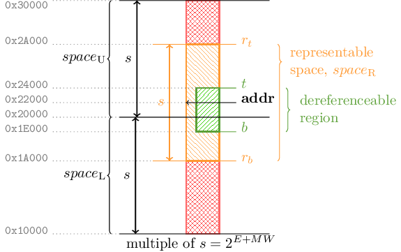
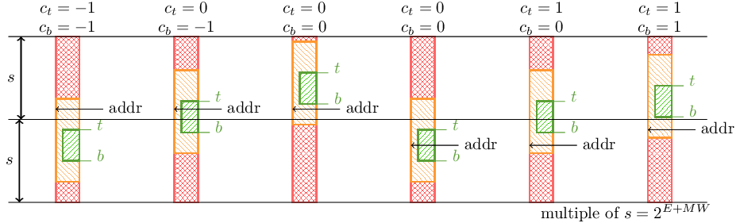

[#rv64y_cap_description, reftext="{rv64y_uni_base_name}"]
== The {rv64y_uni_base_name} Capability Base for {cheri_base64_ext_name}

This section describes the in-memory format and properties of the capability encoding intended for {cheri_base64_ext_name}.

NOTE: The format is closely modeled upon features from CHERI v9 cite:[cheri-v9-spec], and the bounds encoding scheme is based upon CHERI Concentrate cite:[woodruff2019cheri].

[#section_cap_encoding64]
=== Capability Encoding

.Capability encoding for {rv64y_uni_base_name}
[#cap_encoding_xlen64]
include::img/cap-encoding-xlen64.edn[]

NOTE: Reserved bits must be 0 in valid capabilities and are available for future extensions to {cheri_base_ext_name}.

The encoding diagram above of the capability encoding format includes some fields which depend upon the presence of extensions:

<<section_cheri_hybrid_ext>>::
When <<section_cheri_hybrid_ext>> is implemented
+
* The <<p_bit>> is implemented, otherwise _reserved zero_.

<<section_zylevels1>>::
When <<section_zylevels1>> is implemented:
+
* The <<zylevels1_gl_flag,GL>> flag is implemented, otherwise _reserved zero_.
* The <<AP-field>> includes <<zylevels1_lg_perm>> and <<zylevels1_sl_perm>>. Otherwise both are _reserved one_.

The bit ranges in <<cap_encoding_xlen64_field_table>> are relative to the XLEN-bit metadata, i.e., the upper half of the in-memory representation.

.{rv64y_uni_base_name} capability encoding format metadata fields
[#cap_encoding_xlen64_field_table,width="100%",options=header,cols="1,1,4"]
|==============================================================================
| Field      | Bit range | Comment
| SDP        | 63:60     | <<SDP-field64, Software Defined Permissions>>.
| AP         | 52:45     | <<AP-field, Architectural Permissions>>, see <<cap_perms_encoding64>>.
| P          | 44        | <<p_bit, Pointer Mode>> (<<section_cheri_hybrid_ext>> only).
| GL         | 43        | <<zylevels1_gl_flag, Global (GL) flag>> (<<section_zylevels1>> only).
| CT         | 27        | <<CT-field, Capability Type field>>.
| EF         | 26        | Exponent format for the <<section_cap_bounds,capability bounds>> decoding, see <<rvy64_uni_base_name_bndsenc_param_summary>>.
| T[11:3]    | 25:17     | Top address field for the <<section_cap_bounds,capability bounds>> decoding, see <<rvy64_uni_base_name_bndsenc_param_summary>>.
| TE         | 16:14     | Top address or exponent field for the <<section_cap_bounds,capability bounds>> decoding, see <<rvy64_uni_base_name_bndsenc_param_summary>>.
| B[13:3]    | 13:3      | Base address field for the <<section_cap_bounds,capability bounds>> decoding, see <<rvy64_uni_base_name_bndsenc_param_summary>>.
| BE         | 2:0       | Base address or exponent field for the <<section_cap_bounds,capability bounds>> decoding, see <<rvy64_uni_base_name_bndsenc_param_summary>>.
3+| All other fields are _reserved_
|==============================================================================

NOTE: T[13:12], T[2:0] and B[2:0] are not specified by the metadata fields and are calculated as shown in <<section_cap_bounds_decoding>>.

==== Capability Encoding Parameter Summary

.{rv64y_uni_base_name} capability encoding format parameters
[#rvy64_uni_base_name_param_summary,width="100%",options=header,cols="1,1,4"]
|==============================================================================
| Parameter   | Default Value        | Comment
| MW          | {cap_rv64_mw_width}  | Mantissa width for the bounds encoding
| EW          | {cap_rv64_exp_width} | Exponent width for the bounds encoding
| CAP_MAX_E   | {cap_rv64_exp_max}   | Maximum exponent value
| enableL8    | 0                    | Whether the encoding format includes the `L~8~` bit
| AP_MAX      | All ones             | Value of the <<AP-field>> giving maximum permissions
| AP_ENC      | full1_rv64ya_1       | Encoding scheme for the <<AP-field>> - all combinations are representable
| AUIPC_SHIFT | 12                   | Shift distance of the immediate in AUIPC
| REP_RANGE   | rc1                  | Whether out of bounds addresses are representable
|==============================================================================

.{rv64y_uni_base_name} extension summary
[#rvy64_uni_base_name_ext_summary,width="100%",options=header,]
|==============================================================================
| Extension                    | Comment
| <<section_cheri_hybrid_ext>> | Compatible
| <<section_zylevels1>>        | Compatible
ifndef::cheri_ratification_v1_only[]
| <<section_zyseal>>           | Will be compatible once new permissions are encoded
endif::[]
| All RV64Y versions of other standard extensions | Compatible
|==============================================================================

[#AP-field-encoding64, reftext="AP-field encoding"]
==== Architectural Permissions (AP) Encoding

The permissions field is {cap_rv64_perms_width} bits wide and is encoded using one bit per architectural permission as shown in xref:cap_perms_encoding64[xrefstyle=short].
Some bit patterns are _reserved_ because they encode illegal combinations of permissions (see xref:sec_permission_transitions[xrefstyle=short]).

.Encoding of architectural permissions for {rv64y_uni_base_name}
[#cap_perms_encoding64,align="center",options=header,cols="^10%,90%",width="75%"]
|==============================================================================
| Bit | Encoded permission
| 0   | <<c_perm>>
| 1   | <<w_perm>>
| 2   | <<r_perm>>
| 3   | <<x_perm>>
| 4   | <<asr_perm>>
| 5   | <<lm_perm>>
| 6   | <<zylevels1_lg_perm>> (<<section_zylevels1>>)
| 7   | <<zylevels1_sl_perm>> (<<section_zylevels1>>)
|==============================================================================

NOTE: Future extensions which define new permissions must augment <<cap_perms_encoding64>>.

[NOTE]
====

There are 9 bits in total allocated to the <<AP-field>> and the <<p_bit>>.

* The total valid combinations of C, W, R, LM, LG and SL are 18.
* The total valid combinations of X, ASR and P are 5.
* The two groups are fully orthogonal.

Therefore there are 90 valid combinations encoded in 9-bits.

Future extensions or capability encoding formats may leverage these reserved patterns to implement a more compact joint <<AP-field>> and <<p_bit>> encoding that is fully _compatible for all software_ to increase the number of reserved bits.

// The existing encoding is not dense but is beneficial for the timing of reading capability data from data caches, as an implicit <<CLRPERM>> is required to filter loaded permissions.
// The current encoding removes the need to unpack and repack permissions, which a more compact encoding is likely to need.
//
// Such an encoding would have observable differences in the in-memory representation of capabilities.

====

[#SDP-field64, reftext="SDP-field"]
==== Software-Defined Permissions (SDP) Encoding

The <<SDP-field64>> is {cap_rv64_sdp_width} bits wide.
The value of the <<SDP-field64>> bits of the <<GCPERM>> result maps 1:1 to the <<SDP-field64>> in the capability.

[#section_cap_sealed]
==== Capability Type (CT) Encoding

The <<sec_cap_type>> is as specified in <<table_capability_types>>.

The capabilities of this chapter define a 1-bit field for <<sec_cap_type>> values;
this field directly encodes the values `0` and `1`:

* The encoded value `0` indicates an _unsealed_ type.
* The encoded value `1` indicates a _sealed_ type which is _unsealed_ if passed to <<JALR_CHERI>> in `{cs1}`, and is used to _seal_ the capability written to `{cd}`.

ifndef::cheri_ratification_v1_only[]
ifdef::cheri_v9_annotations[]
WARNING: *CHERI v9:* There is now a 1-bit otype (sentry or unsealed) and the old CHERI v9 otype no longer exists.
The base CHERI-RISC-V standard does not have support for CHERI v9 CSEAL for sealed capabilities with object types and only has <<CT-field>>=1 for sealed entry (sentry) capabilities.
endif::[]

The capabilities of this chapter define a 1-bit field for <<sec_cap_type>> values;
this field directly encodes the values `0` and `1`.
The value `1` is...

* considered <<sec_cap_type_ambient,ambiently available>> for <<CBLD>>,

* used as the type for capabilities sealed by <<YSEAL>> instructions,
  not requiring a specific sealing permission.

Additionally, <<JALR_CHERI>> both

* unseals input capabilities of type 1 and

* seals its return capabilities with type 1.

<<JALR_CHERI>> places no constraints on the triple of input <<sec_cap_type>> value, `{cd}` selector, and `{cs1}` selector.
That is, <<JALR_CHERI>> will, as directed, attempt to jump to any unsealed or sealed capability in any register regardless of which register comes to hold the sealed return pointer.

[NOTE]
=====
The permission encodings of <<rv64y_cap_description>> do not provide mappings for
the <<section_zyseal>> extension's <<zyseal_se_perm>> or <<zyseal_us_perm>>.
Thus, without further revision, the encodings of this chapter
are incompatible with the <<section_zyseal>> extension.
=====
endif::[]

[#section_cap_bounds]
==== Bounds (EF, T, TE, B, BE, L8) Encoding

===== Concept

ifdef::cheri_v9_annotations[]
NOTE: *CHERI v9 Note:* The sense of the exponent is reversed, so an encoded
value of 0 represents CAP_MAX_E, and CAP_MAX_E represents 0 from the previous
specification.
endif::[]

This bounds encoding scheme is based upon cite:[woodruff2019cheri].

The bounds encode the base and top addresses that constrain memory accesses.
The capability can be used to access any memory location A in the range base
{le} A < top. The bounds are encoded in a compressed format, so it is not
possible to encode any arbitrary combination of base and top addresses. An
invalid capability is produced when attempting to construct a
capability that is not _representable_ because its bounds cannot be correctly
encoded.

The bounds field has the following components:

.{rv64y_uni_base_name} capability bounds encoding fields
[#rvy64_uni_base_name_bndsenc_param_summary,width="100%",options=header,cols="1,4"]
|==============================================================================
| Variable  | Description
| T         | Value substituted into the capability's address to decode the top address.
| TE        | Value either substituted into the exponent or the top address depending on EF.
| B         | Value substituted into the capability's address to decode the base address.
| BE        | Value either substituted into the exponent or the base address depending on EF.
| E         | Exponent that determines the position at which T and B are substituted into the capability's address.
| L~8~^1^   | Value used to form either the MSB of the exponent or the MSB of the top bound.
| EF        | Exponent format flag indicating the encoding for T, B and E: +
EF=0: The exponent is calculated from TE and BE, and conditionally L8, so it is 'internal'. +
EF=1: The exponent is zero; TE, BE and L8 form part of the address bounds.
|==============================================================================

^1^ Only valid if `enableL8=1`.

The variables in <<rvy64_uni_base_name_bndsenc_param_summary>> are either taken directly from the capability metadata (see <<cap_encoding_xlen64_field_table>>) or, in the case of the upper and lower bits of `T` and `B`, are calculated from it.
They are used as shown in the <<bounds_variable_usage,pseudo-code>> below.

The bit widths of T and B are defined in terms of the mantissa width (MW) which
is set depending on capability encoding as shown in
xref:rvy64_uni_base_name_param_summary[xrefstyle=short].

The exponent E indicates the position of `T` and `B` within the capability's
address as described in xref:section_cap_bounds_format[xrefstyle=short]. The bit
width of the exponent (`EW`) is set depending on the encoding. The
maximum value of the exponent is calculated as follows:

[source]
----
CAP_MAX_E = XLEN - MW + 2
----

The values of EW and CAP_MAX_E are shown in
xref:rvy64_uni_base_name_param_summary[xrefstyle=short].

NOTE: The address and bounds must be representable in valid capabilities i.e.,
when the {ctag} is set (see xref:section_cap_malformed[xrefstyle=short]).

[#section_cap_bounds_decoding]
===== Calculation of Variables

The metadata is encoded in a compressed format termed CHERI Concentrate cite:[woodruff2019cheri]. It
uses a floating point representation to encode the bounds relative to the
capability address. The following subsections describe how the base and top
addresses are decoded from the metadata.

The pseudocode below is normative.
In this notation, `/` means "integer division", `[]` are the bit-select operators, `{}` is bit concatenation, `?:` is the conditional operator, and arithmetic is signed.

NOTE: The pseudocode is intentionally simpler than the equivalent definitions in the SAIL model.

ifdef::cheri_v9_annotations[]
NOTE: *CHERI v9 Note:* The IE bit from CHERI v9 is renamed EF and its value is
inverted to ensure that the <<null-cap>> capability is encoded as zero without the
need for CHERI v9's in-memory format. +
When EF=1, the exponent E=0, so the address bits a[MW - 1:0] are replaced
with T and B to form the top and base addresses respectively. +
When EF=0, the exponent `E=CAP_MAX_E - ( enableL8 ? { L~8~, TE, BE } : { TE, BE } )`,
so the address bits a[E + MW - 1:E] are replaced with T and B to form the top
and base addresses respectively. E is computed by subtracting from the maximum
possible exponent CAP_MAX_E which can be efficiently implemented in hardware
assuming that T and B are at bit CAP_MAX_E and performing a logical bitwise
shift right by E. In contrast, CHERI v9 implementations computed the top and
base addresses by assuming that T and B are at bit 0 and performing a logical
bitwise shift left by E.
endif::[]

anchor:bounds_variable_usage[]

In the pseudo-code below:

* `EF`, `T`, `TE`, `B` and `BE` are all encoded in the capability metadata, see <<cap_encoding_xlen64_field_table>>
** `L8` is also a capability metadata field but only encoded if `enableL8=1`.
* `EW`, `MW`, `CAP_MAX_E` and `enableL8` are all capability encoding format parameters, see <<rvy64_uni_base_name_param_summary>>.
* `LCout` and `LMSB` are intermediate values used to reconstitute the top two bits of `T`, see below.

[source]
----
If EF = 1:
    E               = 0
    T[EW / 2 - 1:0] = TE
    B[EW / 2 - 1:0] = BE
    LCout           = (T[MW - 3:0] < B[MW - 3:0]) ? 1 : 0
    LMSB            = enableL8 ? L8 : 0
else:
    E               = CAP_MAX_E - ( enableL8 ? { L8, TE, BE } : { TE, BE } )
    T[EW / 2 - 1:0] = 0
    B[EW / 2 - 1:0] = 0
    LCout           = (T[MW - 3:EW / 2] < B[MW - 3:EW / 2]) ? 1 : 0
    LMSB            = 1
----

T and B are both MW bits wide, and are formed of different bit ranges:

* `T[MW - 1:MW - 2]` is specified below.
* `T[MW - 3:EW / 2]` is taken directly from the capability metadata.
* `T[EW / 2 - 1:0]`  is as specified in the pseudo-code above.
* `B[MW - 1:EW / 2]` is taken directly from the capability metadata.
* `B[EW / 2 - 1:0]`  is as specified in the pseudo-code above.

The design rationale for the two EF cases is as follows:

1. `EF = 1`: The exponent is 0. When `enableL8=1`, `L~8~` encodes the MSB of the length,
which can be used to derive T[MW-1:MW-2], forming a full MW-wide T field.
2. `EF = 0`: The exponent is _internal_ with E stored in the lower bits of T and
`B`, with `L~8~` used for the MSB of `E` when `enableL8=1`. E is chosen so that the most
significant non-zero bit of the length of the region aligns with T[MW - 2] such
that this bit is implied by `E`.

To save space in the encoding metadata, the top two bits of T are not stored directly but reconstituted as follows:

[source]
----
T[MW - 1:MW - 2] = B[MW - 1:MW - 2] + LCout + LMSB
----

This derivation relies on the equality `T = B + L`, where `L` is the encoded length of the capability.
`LMSB` is the value of `L[MW - 2]`, which is known from the values of `EF` and `E` (as well as L~8~ when `enableL8=1`).
`LCout` is the carry out from the lower bits, which is implied by `T[MW - 3:0] < B[MW - 3:0]` since it is
guaranteed that the top is larger than the base.

[#section_cap_bounds_correction_factors]
===== Correction Factors

The correction factors used in the bounds calculation, c~t~ and c~b~, are calculated as shown below using the
definitions in xref:cap_encoding_ct[xrefstyle=short] and
xref:cap_encoding_cb[xrefstyle=short].

`R` marks the lower boundary of the <<section_cap_representable_check,representable range>> (see <<cap_bounds_map>>).
If `A`, `T` or `B` is less than `R`, then it lies in the 2^E+MW^ aligned region above `R`, and the corrections _c~t~_ and _c~b~_ adjust the upper bits of the decoded bounds accordingly.

As shown in xref:section_cap_bounds_format[xrefstyle=short] below, the upper bits of the bound are computed by substituting B or T into the upper bits of the capability address.                          
This substitution is only correct if the memory bound and the capability address lie within the same 2^E+MW^-aligned region.                                                                               
When they do not (address 0x20000 in <<capformat_correction_illustration>>), the correction factors c~t~ and c~b~ adjust the computed upper bits to select the correct region. 

[#capformat_correction_illustration]
.Example capability bounds that use the correction. The base is an s-aligned region below the address, meaning the upper bits (above the mantissa) of the base are smaller than the upper bits of the address. Therefore c~b~=-1. The address and top are in the same region, so c~t~=0.

The calculation of `A` and `R` is as follows.

[source,subs="quotes"]
----
A[MW-1:0] = a[E + MW - 1:E]; // capability address field
R[MW-1:0] = B - 2^MW-2^
----

NOTE: The comparisons in xref:cap_encoding_ct[xrefstyle=short] and
xref:cap_encoding_cb[xrefstyle=short] are _unsigned_.

The correction factors c~b~ and c~t~ are calculated as follows.

.Calculation of top address correction
[#cap_encoding_ct,options=header,cols="^1,^1,^1",width="40%",align="center"]
|==============================================================================
| A < R    | T < R    | _c~t~_
| false    | false    | 0
| false    | true     | +1
| true     | false    | -1
| true     | true     | 0
|==============================================================================

.Calculation of base address correction
[#cap_encoding_cb,options=header,cols="^1,^1,^1",width="40%",align="center"]
|==============================================================================
| A    < R | B    < R | _c~b~_
| false    | false    | 0
| false    | true     | +1
| true     | false    | -1
| true     | true     | 0
|==============================================================================

xref:capformat_correction_cases[xrefstyle=short] shows examples of each of the possible cases that arise from this calculation.

NOTE: Any cases not shown are unreachable.

[#capformat_correction_cases]
.Illustrative examples of the six possible cases for c~t~ and c~b~

In summary, for the base bound:

* If the base bound is below the alignment boundary and the capability address is above the alignment boundary, then c~b~=-1 to correct the base bound downwards.
* If the base bound and the capability address are within the same alignment boundary, then c~b~=0, so the base bound is unchanged.
* If the base bound is above the alignment boundary and the capability address is below the alignment boundary, then c~b~=1 to correct the base bound upwards.

In summary, for the top bound:

* If the top bound is below the alignment boundary and the capability address is above the alignment boundary, then c~t~=-1 to correct the top bound downwards.
* If the top bound and the capability address are within the same alignment boundary, then c~t~=0, so the top bound is unchanged.
* If the top bound is above the alignment boundary and the capability address is below the alignment boundary, then c~t~=1 to correct the top bound upwards.

[#section_cap_bounds_format]
===== Format of the Bounds

The base, _b_, and top, _t_, addresses are derived from the address by
substituting `a[E + MW - 1:E]` with `B` and `T` respectively and clearing the
lower `E` bits.  The most significant bits of _a_ may be adjusted up or down by 1
using corrections _c~b~_ and _c~t~_ to allow encoding memory regions that span
alignment boundaries.

The bounds are formed of three sections as shown in xref:top_bound_dec[xrefstyle=short] and
xref:base_bound_dec[xrefstyle=short].

NOTE: XLEN and MW are constant parameters, but E is decoded from the capability metadata, and so the bit positions of the boundaries between the sections vary.

NOTE: The top bound (_t_) has an additional bit so that the bounds can include the topmost byte of memory.

.Decoding of the XLEN+1 wide top (_t_) bound
[#top_bound_dec]
include::img/top-bound-dec.edn[]

.Decoding of the XLEN wide base (_b_) bound
[#base_bound_dec]
include::img/base-bound-dec.edn[]

xref:top_bound_dec[xrefstyle=short] and xref:base_bound_dec[xrefstyle=short]
include ranges which may not be present when the bounds are decoded:

* If `E = 0` the lower section does not exist.
* If `E+MW=XLEN` then the top section is only the least significant bit of
 _c~t~_ for the top bound, and top section does not exist for the bottom bound.
* If `E+MW>XLEN` then neither top section exists, and so the bounds are calculated
 with no dependency on the address field _a_.

The compressed bounds encoding allows the address to roam over a large
_representable_ region while maintaining the original bounds. This is enabled by
defining a lower boundary R from the out-of-bounds values that allows us to
disambiguate the location of the bounds with respect to an out-of-bounds address.
R is calculated
relative to the base by subtracting 2^MW-2^ from B.
If `B`, `T` or `a[E + MW - 1:E]` is less than `R`, it is inferred that they lie in the
2^E+MW^ aligned region above R labeled space~U~ in
xref:cap_bounds_map[xrefstyle=short] and the corrections _c~t~_ and _c~b~_ are
computed accordingly. The overall effect is that the address can roam
2^E+MW^/4 bytes below
the base address and at least 2^E+MW^/4 bytes above the top address
while still allowing the bounds to be correctly decoded.

//[#cap_bounds_map] moved to intro chapter
//.Memory address bounds encoded within a capability
//image::../cheri/img/cap-bounds-map.png[width=80%,align=center]

[#t_bound_msb_inversion]
===== Top bound MSB correction

A capability has _infinite_ bounds if its bounds cover the entire address space
such that the base address _b_=0 and the top address _t_{ge}2^XLEN^,
i.e., _t_ is an XLEN + 1 bit value. However, _b_ is an
XLEN-bit value and the size mismatch introduces additional complications
when decoding, so the following condition is required to correct _t_ for
capabilities whose <<section_cap_representable_check>> wraps the edge of the address
space:

[source]
----
if ( (E < (CAP_MAX_E - 1)) && (t[XLEN: XLEN - 1] - {0b0, b[XLEN - 1]}) >= 0b10)
    t[XLEN] = !t[XLEN]
----
NOTE: The comparison is _unsigned_.

That is, invert the most significant bit of _t_ if the decoded top and base are one address space (2^XLEN^ bytes) or more apart, and E is too small to allow this.

NOTE: A capability has infinite bounds if E=CAP_MAX_E and it is not
malformed (see xref:section_cap_malformed[xrefstyle=short]); this check is
equivalent to _b_=0 and _t_{ge}2^XLEN^.

[#section_cap_malformed]
===== Malformed Capability Bounds

A capability is _malformed_ if its bounds cannot be correctly decoded.
The following check indicates whether a capability is malformed.
If `enableL8=1` the `L~8~` bit is available in the capability encoding format for extra precision when `EF=1`.

[source]
----
malformedMSB =  (E == CAP_MAX_E     && B         != 0)
             || (E == CAP_MAX_E - 1 && B[MW - 1] != 0)
malformedLSB =  (E  < 0) || (E == 0 && enableL8)
malformed    =  !EF && (malformedMSB || malformedLSB)
----
NOTE: The above includes a special case for encodings where `enableL8=1`.
      In this case, an `EF=0` encoding that decodes to `E=0` (with its implied `LMSB` of one) expresses the same bounds as the `EF=1` format with the L~8~ bit set.
      The `EF=0`, `E=0` encodings are therefore redundant, so they are declared malformed when `enableL8=1`, leaving `EF=1` as the canonical encoding.

Capabilities with malformed bounds:

. Return both base and top bounds as zero, which affects instructions like <<GCBASE>>.
. Cause certain manipulation instructions like <<CADDI>> to always set the {ctag} of the result to zero.

[#section_cap_representable_check, reftext="Representable Range"]
=== Representable Range Check

The concept of the _representability check_ was introduced in <<section_rep_check_concept>>.

The definition of the check is:

* A source capability with address _a_, metadata _m_ that decodes to give the bounds _b_ and _t_.
* A derived capability with arbitrary address _a'_ with the same metadata _m_ that decodes to give the bounds _b'_ and _t'_.

The address _a'_ is within the source capability's _representable range_ if `b == b' && t == t'`.

If the address _a'_ is outside the _representable range_, then the derived capability has the {ctag} set to zero.

==== Practical Information

An artifact of the bounds encoding is that if the new address
causes `t != t'`, then it is also the case that `b != b'`.

The converse is also true, if `b != b'` then `t != t'`.

Therefore, for representable range checking, it is acceptable
to either check `t == t'` or `b == b'`.

The top and bottom capability bounds are formed of two or three sections:

* Upper bits from the address
** This is only if the other sections do not fill the available bits (E + MW < XLEN)
* Middle bits from T and B decoded from the metadata
* Lower bits are set to zero
** This is only if there is an internal exponent (EF=0)

.Composition of the decoded top address bound
[#comp_addr_bounds,options=header,align="center",cols="2,4,2,2"]
|==============================================================================
| Configuration   | Upper Section (if E + MW < XLEN) | Middle Section | Lower Section
| EF=0            | address[XLEN-1:E + MW] + ct | T[MW - 1:0] | zeroes(E)
| EF=1, i.e., E=0 | address[XLEN-1:MW] + ct   2+| T[MW - 1:0]
|==============================================================================

The _representable range_ defines the range of addresses which do not corrupt
the bounds encoding. The encoding was first introduced in
xref:section_cap_bounds[xrefstyle=short], and is repeated in a different
form in xref:comp_addr_bounds[xrefstyle=short] to aid this description.

For the address to be valid for the current bounds encoding, the value
in the _Upper Section_ of xref:comp_addr_bounds[xrefstyle=short] _must
not change_ as this will change the meaning of the bounds.  This
is because `T`, `B` and `E` will be unchanged for the source and
destination capabilities.  Therefore, the Middle and Lower sections
of the bounds calculation are also unchanged for source and
destination capabilities.

When E > CAP_MAX_E - 2, the calculation of the top bound is entirely derived
from `T` and `E`, which will be identical for both the source and destination
capabilities, thus guaranteeing that `t == t'`.  Likewise, with such values of E, the
base bound is entirely derived from `B` and `E` and therefore `b == b'`.

The calculation of the MSB of the top bound may be inverted as specified
in xref:t_bound_msb_inversion[xrefstyle=short].
Assuming `(E < (CAP_MAX_E - 1))`, the truth-table for this inversion is as follows:

.Top bound MSB inversion truth table
[#t_bound_msb_inversion_truth_table]
[options=header,align=center,width="100%"]
|==============================================================================
| input_t[XLEN:XLEN-1]  | b[XLEN-1]  | output_t[XLEN:XLEN-1]
|      00                 |      0      | 00
|      01                 |      0      | 01
|      10                 |      0      | 00
|      11                 |      0      | 01
|     *00*                |     *1*     | *10*
|      01                 |      1      | 01
|     *10*                |     *1*     | *10*
|      11                 |      1      | 01
|==============================================================================

Inspection of xref:t_bound_msb_inversion_truth_table[xrefstyle=short] shows
that `output_t[XLEN]` does not depend on `input_t[XLEN]` as:

* `output_t[XLEN] = {input_t[XLEN-1], b[XLEN-1]} == 0b01`.

This leads to the conclusions:

* If `t[XLEN-1] == t'[XLEN-1]` and `b[XLEN-1] == b'[XLEN-1]`, then it is guaranteed `t[XLEN] == t'[XLEN]`.
* If `t[XLEN-1] != t'[XLEN-1]` or `b[XLEN-1] != b'[XLEN-1]`, then the representable check will fail regardless of checking `t[XLEN] == t'[XLEN]`.

Therefore, for the purpose of representable range checking, it is not
required to check that `t[XLEN]==t'[XLEN]`.

Given that `t[XLEN]` is not part of the representable range check:

* when `E == CAP_MAX_E - 2`, `t[XLEN-1:E] == T[MW-1:0]` and `b[XLEN-1:E] == B[MW-1:0]`.

Therefore, `T` and `B` are both derived from the capabilities metadata and are
therefore constant.  Therefore, the representable range check always passes in this case too.

As a result:

* If E > CAP_MAX_E - 3, then the representability check always passes, _even
though the bounds are only infinite if E = CAP_MAX_E_

This gives a range of `s=2^E+MW^`, as shown in
xref:cap_bounds_map[xrefstyle=short].

The gap between the object bounds and the bound of the representable range
is always guaranteed
to be at least 1/4 of `s`. This is represented by `R = B - 2^MW-2^` in
xref:section_cap_bounds[xrefstyle=short].
This gives useful guarantees, such that if an executed instruction is in
<<pcc>> bounds, then it is also guaranteed that the next linear instruction
is _representable_.

[#section_special_caps_encoding]
=== Encoding of Special Capabilities

[#section_null_cap_encoding]
==== NULL Capability Encoding

ifdef::cheri_v9_annotations[]
NOTE: *CHERI v9 Note:* Encoding <<null-cap>> as zeros removes the need for
the difference between in-memory and architectural format.
endif::[]

The <<null-cap>> capability is represented with 0 in all fields. This implies
that it has no permissions and its exponent E is CAP_MAX_E ({cap_rv64_exp_max}).
The exponent value causes its bounds to cover the entire address space, but no permissions are granted and so it cannot successfully be used to grant authorization.

.Field values of the NULL capability
[#null-cap-encoding,reftext="NULL",options=header,align=center,width="70%",cols="25,23,52"]
|==============================================================================
| Field    | Value  | Comment
| {ctag_title}             | zero   | Capability is not valid
| <<SDP-field64,SDP>>        | zeros  | Grants no permissions
| <<AP-field,AP>>          | zeros  | Grants no permissions
| CT       | zero   | Unsealed
| EF       | zero   | Internal exponent format
| L~8~^1^  | zero   | Top address reconstruction bit
| T        | zeros  | Top address bits
| T~E~     | zeros  | Exponent bits
| B        | zeros  | Base address bits
| B~E~     | zeros  | Exponent bits
| Address  | zeros  | Capability address
| Reserved | zeros  | All reserved fields
|==============================================================================

^1^ Only present if `enableL8=1` as defined by the capability encoding format.

Permissions added by extensions (such as those of <<section_zylevels1>>) are presumed absent in NULL capabilities.

[#section_infinite_cap_encoding]
==== Infinite Capability Encoding

This encoding is for an _Infinite_ capability value, which
grants all permissions while its bounds also nominally cover the whole address space.
This infinite capability is both a <<root-rx-cap>> and a <<root-rw-cap>> capability.

.Field values of the Infinite capability
[#infinite-cap-encoding,reftext="Infinite"]
[options=header,align=center,width="90%",cols="25,23,52"]
|==============================================================================
| Field         | Value | Comment
| {ctag_title}  | one   | Capability is valid
| <<SDP-field64,SDP>> | ones  | Grants all permissions
| <<AP-field,AP>>     | AP_MAX | Grants all permissions
| CT            | zero  | Unsealed
| EF            | zero  | Internal exponent format
| L~8~^1^       | zero  | Top address reconstruction bit
| T             | zeros | Top address bits
| T~E~          | zeros | Exponent bits
| B             | zeros | Base address bits
| B~E~          | zeros | Exponent bits
| Address       | any^2^ | Capability address
| Reserved      | zeros | All reserved fields
|==============================================================================

^1^ Only present if `enableL8=1` as defined by the capability encoding format.

^2^If an infinite capability is used as a constant in either hardware or software, then the address field will typically be set to zero.
 If the address field is non-zero then it is still referred to as an infinite capability, and it still has the authority to authorize all memory accesses.

Permissions added by extensions (such as those of <<section_zylevels1>>) are presumed present in Infinite capabilities, which may involve redefining the AP_MAX value.
