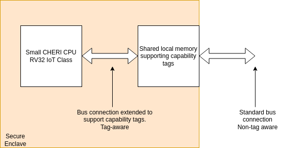

== CHERI System Implications

ifdef::cheri_standalone_spec[]
WARNING: Unclear if this chapter will appear in the priv spec. May just be in the standalone spec.
endif::[]

CHERI processors need memory systems which support the {ctag}s in memory.

There are, or will soon be, a wide range of CHERI systems in existence from tiny IoT devices up to server chips.

There are two types of bus connections used in SoCs which contain CHERI CPUs:

. Tag-aware busses, where the bus protocol is extended to carry the {ctag} along with the data.  This is typically done using user-defined bits in the protocol.
.. These busses will read {ctag}s from memory (if {ctag}s are present in the target memory) and return them to the requestor.
.. These busses will write the {ctag} to memory as an extension of the data write.
. Non-{ctag}-aware busses, i.e., current non-CHERI-aware busses.
.. Reads of tagged memory will not read the {ctag}.
.. Writes to tagged memory will set the {ctag} to zero of any YLEN-aligned YLEN-wide memory location where any byte matches the memory write.

The fundamental rule for any CHERI system is that the {ctag} and data are always accessed atomically. For every naturally aligned YLEN-wide memory location, it must never be possible to:

. Update any data bytes without also writing the {ctag}
.. This implies setting the {ctag} to zero if a non-CHERI aware bus master overwrites a capability in memory
. Read a {ctag} value with mismatched (stale or newer) data
. Set the {ctag} without also writing the data.

NOTE: Clearing {ctag}s in memory does not necessarily require updating the associated data.

=== Small CHERI system example

[#small_cheri_system]
.Example small CHERI system with local {ctag} storage

This example shows a minimum-sized system where only the local memory is extended to support {ctag}s.
The {ctag}-aware region is highlighted.
All {ctag}s are created by the CHERI CPU, and only stored locally. The memory is shared with the system, probably via a secure DMA, which is not {ctag}-aware.

Therefore the connection between CPU and memory is tag-aware, and the connection to the system is not {ctag}-aware.

All writes from the system port to the memory must clear any memory {ctag}s to follow the rules from above.

=== Large CHERI system example

[#large_cheri_system]
.Example large CHERI system with {ctag} cache
image::../cheri/img/large_cheri_system.drawio.png[width=80%,align=center]

In the case of a large CHERI SoC with caches, all the cached memory visible to the CHERI CPUs must support {ctag}s.
All memory is backed up by DRAM, and standard DRAM does not offer the extra bit required for CHERI {ctag} storage and so a typical system will have a {ctag} cache IP.

A region of DRAM is typically reserved for CHERI {ctag} storage.

The {ctag} cache sits on the boundary of the {ctag}-aware and non-tag-aware memory domains, and it provides the bridge between the two.
It stores {ctag}s locally in its cache, and if there is a miss, it will create an extra bus request to access the region of DRAM reserved for {ctag} storage.
Therefore in the case of a miss a single access is split into two - one to access the data and one to access the {ctag}.

The key property of the {ctag} cache is to preserve the atomic access of data and {ctag}s in the memory system so that all CPUs have a consistent view of {ctag}s and data.

The region of DRAM reserved for {ctag} storage must be accessible only by the {ctag} cache, therefore no bus initiators should be able to write to the DRAM without the transactions passing through the {ctag} cache.

Therefore the GPUs and peripherals cannot write to the {ctag} storage in the DRAM or the {ctag} supporting memory data storage region.
These constraints will be part of the design of the network-on-chip.
It _is_ possible for the GPU and peripherals to read the {ctag}ged memory data storage region of the DRAM, if required.

NOTE: It would be possible to allow a DMA to access the {ctag}ged memory region of the DRAM directly to allow swap to/from DRAM and external devices such as flash.
 This will require the highest level of security in the SoC, as the CHERI protection model relies on the integrity of the {ctag}s, and so the root-of-trust will need to authenticate and encrypt the transfer, with anti-rollback protection.

For further information on the {ctag} cache see cite:[tagged-memory].

<<<

=== Large CHERI pure-capability system example

[#large_cheri_purecap_system]
.Example large CHERI system with only tag-aware bus masters
image::../cheri/img/large_cheri_purecap_system.drawio.png[width=80%,align=center]

In this example every DRAM access passes through the {ctag} cache, and so _all_ bus masters are {ctag}-aware and can access the {ctag}s associated with memory if permitted by the network-on-chip.

The system topology is simpler than in xref:large_cheri_system[xrefstyle=short].

There is likely to be a performance difference between the two systems.
The main motivation for xref:large_cheri_system[xrefstyle=short] is to avoid the GPU DRAM traffic needing to look-up every {ctag} in the {ctag} cache, potentially adding overhead to every transaction.
